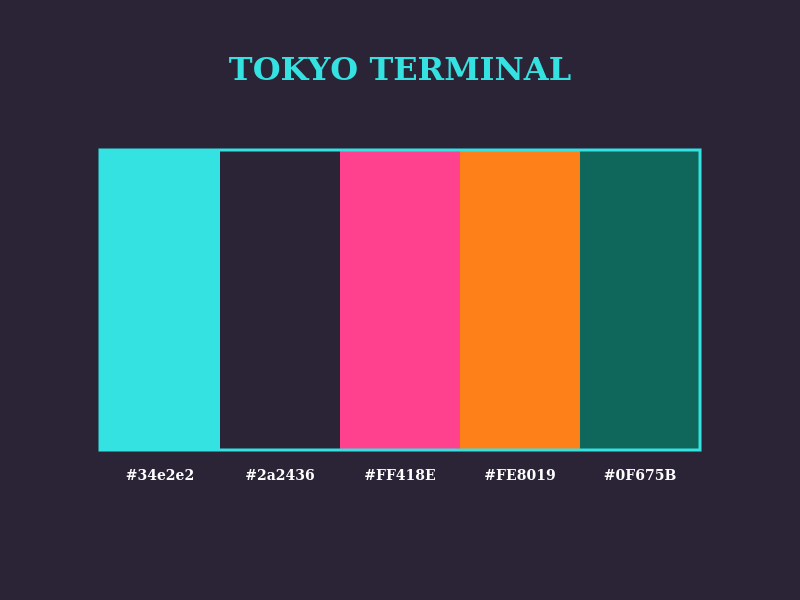

[README]
---

### **Short Description (for marketplace/extension metadata)**
```
***tokyo_terminal*** is a high-contrast, neon-drenched VSCode theme inspired by a **retro-futurist 80s terminal** aesthetics, and Tokyo’s electric nights.
Built for clarity and vibrancy, with accentuation for maximum visual efficiency.
Designed @ TSLST (2026)
```

---

### **Long README Introduction**
**Welcome to *tokyo_terminal***, a VSCode theme that transports your editor to a neon-lit japanese terminal circa 1984.
This isn’t just a color scheme; it’s a high-contrast, high-energy workspace for developers who crave **clarity and visual accentuation**.

#### **Design Philosophy**
Inspired by the **hypnotic glow of vintage CRTs**, the **hyper-saturated dreams of synthwave**, *vibrancy of outrun nostalgia*, tokyo_terminal is a love letter to the 80s as I reimagined, restylized and modernized them.
Think of **synths, oversaturated consoles**, a world of outrun sunsets, VHS static, and cyber alleyways. With a nod to Taki Ono’s neon design photography, this theme merges retro-futurism with modern clarity.

Here for VSCodium, *tokyo_terminal* delivers:
- **Bold readability**: Crisp **cyan (#34e2e2)** syntax on deep **purple (#2a2436)** and **near-black (#060507)** backgrounds.
- **Electric accents**: **Hot pink (#FF418E)**, **sunset orange (#FE8019)**, **gold (#FFE61C)**, and **deep violet (#6C18D6)** for keywords, functions, and UI highlights.
- **Retro-futuristic contrast**: Designed to reduce eye strain while keeping your code *visually alive*—like hacking a mainframe in a cybercafé circa 1984.
- **Minimalist efficiency** grit meets glamour.

For developers nostalgic of the future. For those who code like the future depends on it (Because it does).

## Screenshots



---
**Made by TLSLT in 2026 under MIT License**
[GitHub](https://github.com/TSLST)
[Mastodon](https://mastodon.social/@TSLST)